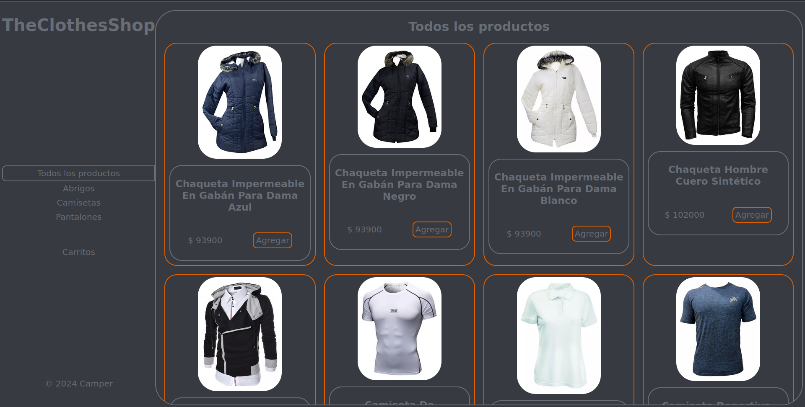
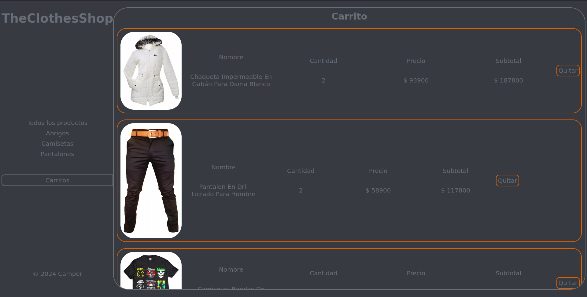
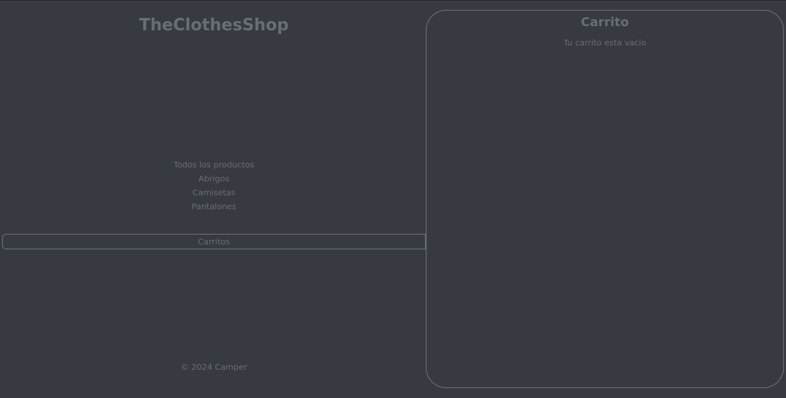

# The-Clothes-Shop 🚀
## Tabla de contenidos 📚
- [Descripcion](#descripcion)
- [Proceso](#proceso)
- [Caracteristicas](#caracteristicas)
- [Tecnologias](#tecnologias)
- [Instalacion](#instalacion)
- [Screenshots](#screenshots)
- [Uso](#uso)
- [Autor](#autor)
- [Contacto](#contacto)
<h3 id="descripcion">Descripcion 📖</h3>

Se hizo un e-commerce en donde se venden productos como chaquetas, pantalones y camizetas, haciendo la pagina se utilizaron varios elementos vistos en clase y tambien se utilizo el responsive.
<h3 id="proceso">Proceso 📋</h3>

El proceso para hacer el proyecto fue:
1. Se maqueto la pagina con HTML.
2. Se puso la decoracion de la pagina con el CSS.
3. Se agrego el reponsive de la pagina con CSS.
<h3 id="caracteristicas">Caracteristicas 💡</h3>

En la creracion del evaluativo se utilizaron las tecnologias de HTML para la maquetacion de la pagina, CSS para la decoracion, responsive, Visual Studio Code para la creacion y edicion del codigo y un navegador para la prueva del HTML.
<h3 id="tecnologias">Tecnologias 💻</h3>

- HTML: Maquetacion del evaluativo.
- CSS: Decoracion y Responsive del evaluativo.
- VS Code: Para la creacion y edicion del evaluativo.
- Navegador: Para para la prueva del evaluativo. 
<h3 id="instalacion">Instalacion 💾</h3>

Clonar repositorio:
```sh
https://github.com/JavierEAcevedoN/The-Clothes-Shop.git
```
<h3 id="screenshots">Screenshots 📷</h3>

  
Pagina principal de los productos.
  
Pagina del carrito de los productos.
  
Pagina del carrito vacio.
<h3 id="uso">Uso ✋</h3>

Descarga el zip de la pagina y ejecuta el `index.html` o clona el repositorio y ejecuta con el live server en VS Code.
O se puede abrir con el siguiente enlace:
- [Pagina](https://javiereacevedon.github.io/The-Clothes-Shop/E-commerce%20%22TheClothesShop%22/index.html)
<h3 id="autor">Autor 👤</h3>

- [JavierEAcevedoN](https://github.com/JavierEAcevedoN)
<h3 id="contacto">Contacto 📱</h3>

- Linkedin: [Javier Eduardo Acevedo Noguera](https://www.linkedin.com/in/javier-eduardo-acevedo-noguera)
